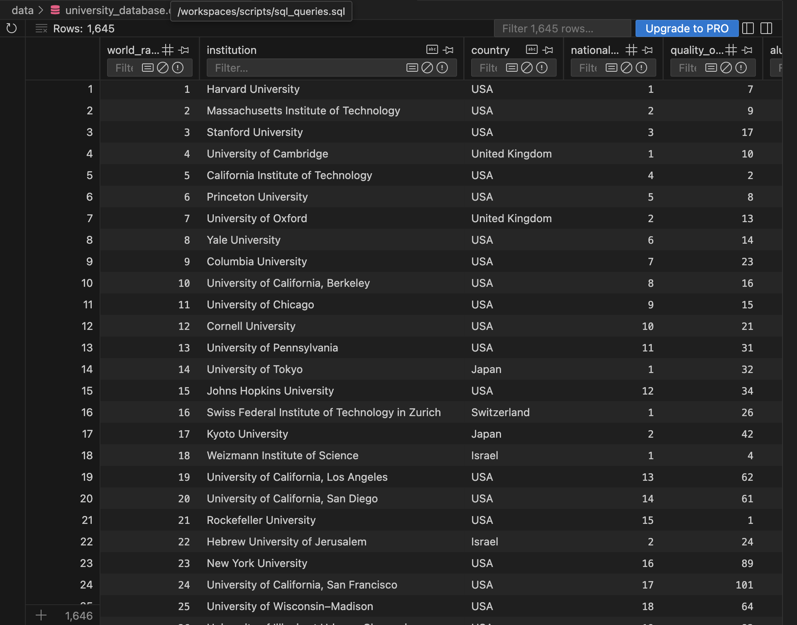
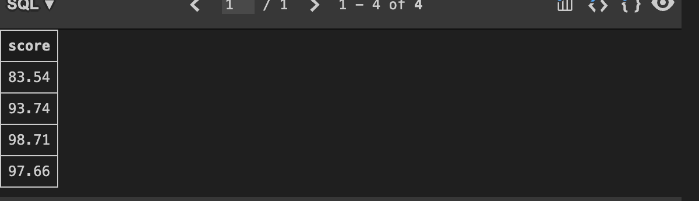

# Essential SQL Queries and Usage Guide

**Author:** Ogechukwu Ezenwa  
**Date:** October 7, 2025  
**Course:** IDS 706 – Data Engineering Systems  
**Assignment:** Week 6 Mini-Assignment-Introduction to Databases

---

## Overview

This repository contains a collection of useful SQL queries for various database operations and scenarios. The queries are organized by topic and are intended to help with basic data analysis, CRUDE steps, and database management tasks.

## Project Structure 
```bash
.
├── .devcontainer
│   ├── devcontainer.json
│   └── docker-compose.yml
├── README.md
├── data
│   └── university_database.db
└── scripts
    └── sql_queries.sql
```

## Usage

1. Clone this repository:
    ```bash
    git clone <repository-url>
    ```
2. This project uses a devcontainer to provide a consistent development 
environment. When prompted, select “Reopen in Container.”  
    - All required extensions and packages for database access are pre-installed and configured automatically. 
    - By reopening the project in a compatible editor like VS Code and selecting “Reopen in Container,” you’ll have immediate access to all necessary tools—such as database drivers, CLI utilities, and VS Code extensions ensuring a smooth and reliable setup for development and analysis.
3. Browse the `sql_queries` directory for categorized SQL scripts.
4. Copy and adapt queries as needed for your database.

## Requirements

- A SQL-compatible database (e.g., MySQL, PostgreSQL, SQLite, SQL Server)
- Access to a database client or management tool
- If sqlite3 isn't working on the terminal, use the code below.

    ```bash
    install sudo apt update && sudo apt install -y sqlite3
    ```

## Dataset Information

The data is found in the data folder. It can also be downloaded from this https://drive.google.com/file/d/1hEXaWbL4XKRp-NvVjqRUCfPfA-Zs_Qug/view.

**Table Name:** `university_rankings`  
**Columns:**  
- `world_rank` – Global ranking of the institution  
- `institution` – University name  
- `country` – Country of the institution  
- `national_rank` – Rank within the country  
- `quality_of_education`, `alumni_employment`, `quality_of_faculty`, `publications`, `influence`, `citations`, `broad_impact`, `patents` – Various academic and research performance metrics  
- `score` – Overall performance score  
- `year` – Year of ranking  

**Total Records Initially:** `2200`

**Viewing the university_rankings table using SQLite Viewer**

()

## Features

- CRUD operations (Create, Read, Update, Delete) examples
- Basic analysis queries (COUNT, MAX, MIN, SUM)

### CRUD Operations

**Create**
- Inserted a new record for Duke Tech (USA) in 2014 with the following details:  
  - World Rank: 350  
  - Score: 60.5  

```sql
--  Fetch the first 10 rows of data from the table
INSERT INTO university_rankings(institution, country, world_rank, score, year)
VALUES ("Duke Tech", "USA", 350, 60.5, 2014);

-- Retrieve the record we just created
SELECT * 
FROM university_rankings
WHERE institution = "Duke Tech";
```
**Read**
- Displayed the first 10 rows of the dataset to inspect data values and structure.  
- Retrieved all column names using PRAGMA to understand the table schema.  
- Verified that the Duke Tech record was successfully inserted.  
- Counted how many Japanese universities appeared in the global top 200 in 2013.  

```sql
--  Fetch the first 10 rows of data from the table
SELECT *
FROM university_rankings
LIMIT 10;

-- The list of all the column names.
PRAGMA table_info(university_rankings);

--  How many universities from Japan show up in the global top 200 in 2013?
SELECT COUNT(*) AS japan_universities_in_top200
FROM university_rankings
WHERE year = 2013 
    AND country = "Japan" 
    AND world_rank <= 200;
```

**Update**
- Increased University of Oxford’s score by +1.2 points in 2014.  
- Queried the table again to confirm the updated score. 

```sql
UPDATE university_rankings
SET score = score + 1.2
WHERE institution = "University of Oxford";
```


**Delete**
- Deleted all universities from 2015 with a score below 45.  
    - There were 556 universities deleted based on the threshold
    - The are 1645 rows left
- Checked the total number of rows after deletion to confirm successful removal.  

```sql
-- Removing universities with a score below 45 in 2015
DELETE FROM university_rankings
WHERE year = 2015 AND score < 45;

SELECT changes() AS rows_deleted;
```

### Basic Analysis
**Dataset Size & Structure**
- Identified all unique institutions in the rankings.  
    - There are 1005 instituitions in the table

```sql
-- Calculating the number of rows I have in the table 
SELECT COUNT(*)
FROM university_rankings;
```

**Ranking Analysis**
- Found the institution with the best world rank (rank = 1).  
    - Harvard university ranked 1 in the word
- Calculated the average world rank across all universities.  

```sql
SELECT institution, world_rank
FROM university_rankings
ORDER BY world_rank ASC
LIMIT 1;

SELECT AVG(world_rank) as world
FROM university_rankings;
```
**Scores & Quality Metrics**
- Computed the maximum, minimum, and average scores across all records.  
- Determined which country had the highest total score across its universities.  

```sql 
SELECT MIN(score) as min_score, 
    MAX(score) as max_score, 
    AVG(score) as avg_socore
FROM university_rankings;

SELECT country, SUM(score) AS total_score 
FROM university_rankings 
GROUP BY country 
ORDER BY total_score DESC;
```
**Yearly Trends**
- Calculated the average and total scores per year to analyze changes over time.  
- Determined how many universities were ranked in each year.  

```sql
SELECT year, AVG(score) as avg_score, SUM(score) as total_score
FROM university_rankings
GROUP BY year; 

SELECT year, COUNT(*) as ranking_universities
FROM university_rankings
GROUP BY year;
```

**Top Performers**
- Listed the top 20 universities based on their quality of education scores.  

```sql
SELECT institution, quality_of_education
FROM university_rankings
ORDER BY quality_of_education DESC 
LIMIT 20;
```


## Insights from the Data

- **Country Dominance:** The USA leads global rankings with the highest total score, followed by the UK and Japan.  
- **Top Performers:** Harvard University consistently ranks highest globally.  
- **Yearly Trends:** There was a dramatic increase in ranked universities in 2014, suggesting dataset expansion or inclusion of more institutions.  
- **Average Scores:** Despite changes in dataset size, average scores remain relatively stable around 50, indicating consistency in university performance metrics.  
- **Data Irregularities:** Some universities have unusually high quality_of_education values (367), which may be placeholders or data entry anomalies.  
- **Japanese Universities:** Only 6 universities appeared in the global Top 200 in 2013, highlighting regional differences in global competitiveness.


